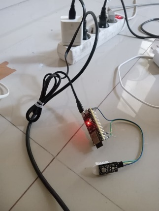

# Pengujian Kestabilan Transmisi Data Sensor DHT22 dan Mekanisme Pembaruan  OTA pada Platform ThingsBoard Menggunakan ESP32-S3
Perkembangan teknologi Internet of Things (IoT) telah membawa dampak besar dalam berbagai bidang, termasuk sistem pemantauan lingkungan dan otomasi berbasis sensor. IoT memungkinkan perangkat seperti sensor dan mikrokontroler untuk saling terhubung melalui jaringan internet, sehingga proses pengumpulan dan pengiriman data dapat dilakukan secara otomatis dan real-time. Salah satu mikrokontroler yang banyak digunakan dalam pengembangan sistem IoT adalah **ESP32-S3**, karena memiliki konektivitas Wi-Fi yang stabil, dukungan terhadap protokol MQTT, serta konsumsi daya yang efisien.
Proyek ini dirancang untuk **menguji kestabilan transmisi data sensor DHT22** serta **menerapkan mekanisme pembaruan firmware Over-The-Air (OTA)** menggunakan platform **ThingsBoard Cloud**. Sensor **DHT22** digunakan untuk membaca suhu dan kelembapan udara, sedangkan **ESP32-S3** berfungsi sebagai pengendali utama yang mengirimkan data ke cloud secara periodik melalui protokol **MQTT**. Platform **ThingsBoard** kemudian menampilkan data tersebut dalam bentuk grafik dan indikator real-time yang dapat diakses melalui dashboard.
Selain pemantauan data sensor, sistem ini juga dilengkapi dengan fitur **OTA update**, yang memungkinkan perangkat menerima pembaruan firmware secara jarak jauh tanpa koneksi kabel fisik. Mekanisme ini memberikan solusi terhadap tantangan umum dalam sistem IoT, yaitu efisiensi pemeliharaan perangkat dan reliabilitas komunikasi data dalam jaringan yang dinamis.
Dengan kombinasi antara **ESP32-S3**, **sensor DHT22**, **protokol MQTT**, dan **platform ThingsBoard Cloud**, proyek ini menghasilkan sebuah sistem IoT yang **efisien, handal, dan mudah dikembangkan**. Implementasi OTA menjadikan perangkat lebih fleksibel dalam pemeliharaan dan pengembangan jangka panjang, sekaligus membuktikan kemampuan Rust Embedded dalam membangun sistem IoT modern yang aman dan stabil.

## Authors
1. Muhammad Salman Alfarisyi (2042231006)  
2. Muhammad Aufa Affandi (2042231011)  
3. Ahmad Radhy (Supervisor)

Teknik Instrumentasi - Institut Teknologi Sepuluh Nopember Surabaya

## ⚙️ Fitur Utama Sistem

Sistem **Pengujian Kestabilan Transmisi Data Sensor DHT22 dan Mekanisme Pembaruan OTA** ini memiliki beberapa fitur utama yang dirancang untuk mendukung kinerja dan keandalan perangkat dalam lingkungan IoT, yaitu:

### 1️⃣ Pemantauan Suhu dan Kelembapan Real-Time
Sistem menggunakan **sensor DHT22** untuk membaca suhu dan kelembapan udara secara periodik. Data hasil pengukuran ditampilkan secara real-time melalui **dashboard ThingsBoard**, sehingga pengguna dapat memantau kondisi lingkungan kapan saja dan di mana saja.

### 2️⃣ Transmisi Data Berbasis MQTT
Perangkat **ESP32-S3** mengirimkan data sensor ke **ThingsBoard Cloud** menggunakan **protokol MQTT (Message Queuing Telemetry Transport)**. Protokol ini dipilih karena ringan, andal, dan efisien dalam penggunaan bandwidth, sehingga cocok untuk aplikasi IoT dengan koneksi nirkabel yang fluktuatif.

### 3️⃣ Pembaruan Firmware Over-The-Air (OTA)
Fitur **OTA update** memungkinkan perangkat menerima pembaruan firmware secara jarak jauh melalui jaringan internet tanpa memerlukan koneksi kabel fisik. Dengan mekanisme ini, perangkat dapat diperbarui secara otomatis ketika versi firmware terbaru tersedia, meningkatkan efisiensi pemeliharaan dan skalabilitas sistem.

### 4️⃣ Dashboard Visualisasi Data
Platform **ThingsBoard Cloud** digunakan untuk menampilkan data dalam bentuk **grafik time-series**, indikator digital, dan tabel historis. Visualisasi ini memudahkan analisis kestabilan transmisi data serta pemantauan performa sistem secara keseluruhan.

### 5️⃣ Analisis Kestabilan dan Latensi Data
Sistem dilengkapi mekanisme pencatatan waktu pengiriman dan penerimaan data untuk menghitung **latensi rata-rata** serta menganalisis **stabilitas koneksi MQTT**. Data hasil pengujian diolah menggunakan **Gnuplot** untuk menghasilkan grafik hubungan antara waktu pengiriman dan variasi delay.

### 6️⃣ Implementasi Bahasa Rust Embedded
Seluruh program dikembangkan menggunakan **bahasa pemrograman Rust**, yang dikenal dengan **keamanan memori (memory safety)** dan **efisiensi eksekusi**. Hal ini menjadikan sistem lebih stabil dan minim error saat dijalankan dalam lingkungan tertanam (embedded environment).

### 7️⃣ Mekanisme Auto-Reconnect Wi-Fi
Perangkat dilengkapi sistem **auto-reconnect** yang akan otomatis mencoba menghubungkan ulang ke jaringan Wi-Fi apabila koneksi terputus. Fitur ini memastikan data sensor tetap terkirim secara kontinu tanpa kehilangan paket data.

---
Dengan fitur-fitur tersebut, sistem ini tidak hanya mampu melakukan **monitoring suhu dan kelembapan secara real-time**, tetapi juga memastikan **keandalan transmisi data dan kemudahan pembaruan firmware**, yang menjadi faktor penting dalam pengembangan sistem IoT berskala besar.

## 🧩 Kebutuhan Sistem

Untuk mendukung implementasi dan pengujian sistem **ESP32-S3 dengan sensor DHT22 dan OTA melalui ThingsBoard Cloud**, diperlukan beberapa komponen perangkat keras dan perangkat lunak yang saling terintegrasi. Sistem ini dikembangkan dan dijalankan sepenuhnya di lingkungan **Ubuntu Linux (terminal)** menggunakan **toolchain Rust Embedded** dan **ESP-IDF**.

---

### 💡 A. Kebutuhan Perangkat Keras

| No | Komponen | Fungsi |
|----|-----------|--------|
| 1 | **ESP32-S3 DevKit** | Mikrokontroler utama yang menjalankan program Rust Embedded dan mengirimkan data ke ThingsBoard Cloud. |
| 2 | **Sensor DHT22 (AM2302)** | Membaca suhu dan kelembapan udara secara periodik dan mengirimkan nilai ke ESP32-S3. |
| 3 | **Kabel Jumper** | Sebagai penghubung antara komponen sensor dan mikrokontroler. |
| 4 | **Adaptor 5V / Charger HP** | Menyediakan sumber daya eksternal yang stabil untuk ESP32-S3 selama pengujian. |
| 5 | **Laptop / PC Ubuntu** | Digunakan untuk proses kompilasi, flashing firmware, dan pengawasan data melalui terminal serta dashboard cloud. |

---

### 💻 B. Kebutuhan Perangkat Lunak

| No | Perangkat Lunak / Library | Fungsi |
|----|----------------------------|--------|
| 1 | **Ubuntu 22.04 / 24.04** | Sistem operasi utama untuk environment pengembangan IoT berbasis Rust dan ESP-IDF. |
| 2 | **Rust (Toolchain 1.77+)** | Bahasa pemrograman utama untuk membangun firmware ESP32-S3. |
| 3 | **ESP-IDF SDK** | Framework resmi dari Espressif untuk mengakses driver Wi-Fi, MQTT, dan fitur OTA pada ESP32-S3. |
| 4 | **espup & espflash** | Tools untuk setup environment dan flashing firmware langsung ke board melalui terminal. |
| 5 | **Cargo & ldproxy** | Build system dan linker Rust untuk cross-compilation ke target ESP32-S3. |
| 6 | **ThingsBoard Cloud** | Platform IoT berbasis web untuk menampilkan data sensor, menyimpan telemetry, dan menjalankan OTA update. |
| 7 | **Gnuplot / LibreOffice Calc** | Alat bantu untuk analisis grafik kestabilan dan latency transmisi data dari hasil pengujian. |

---

### 🌐 C. Kebutuhan Jaringan

1. **Koneksi Wi-Fi lokal (2.4 GHz)** yang stabil untuk komunikasi MQTT antara ESP32-S3 dan ThingsBoard Cloud.  
2. **Akses internet aktif** untuk mendukung proses OTA update dan pengiriman telemetry secara real-time.  
3. **Token autentikasi ThingsBoard** yang valid agar perangkat dapat mengirim data melalui topik MQTT.  

---

### ⚙️ D. Konfigurasi Minimum Sistem

| Parameter | Nilai Minimum | Keterangan |
|------------|----------------|-------------|
| Tegangan Operasional | 5V DC | Sumber daya adaptor untuk ESP32-S3 |
| Rentang Suhu Operasional | 0°C – 50°C | Kondisi lingkungan selama pengujian |
| Interval Pengiriman Data | 60 detik | Waktu publish telemetry DHT22 ke ThingsBoard |
| Kapasitas Firmware | ±1 MB | Ukuran rata-rata hasil kompilasi firmware Rust |
| Kecepatan Internet Minimum | 1 Mbps | Stabilitas komunikasi MQTT & OTA update |

---

Dengan konfigurasi sistem di atas, perangkat **ESP32-S3** dapat bekerja secara optimal untuk melakukan pembacaan sensor, mengirimkan data telemetry ke **ThingsBoard Cloud**, serta menjalankan **pembaruan firmware OTA** langsung melalui terminal Ubuntu tanpa memerlukan server eksternal tambahan.

---

## 🔬 Langkah-Langkah Percobaan

Berikut tahapan lengkap pengujian sistem **ESP32-S3 dengan sensor DHT22 dan mekanisme OTA** pada platform **ThingsBoard Cloud**:

---

### 1️⃣ Persiapan Awal

1. Pastikan perangkat keras tersusun dengan benar:
   - VCC DHT22 → 3.3V ESP32-S3  
   - GND DHT22 → GND ESP32-S3  
   - DATA DHT22 → GPIO4 ESP32-S3  
2. Sambungkan **ESP32-S3 ke laptop Ubuntu** menggunakan kabel USB data.  
3. Pastikan koneksi Wi-Fi lokal (2.4 GHz) aktif dan dapat diakses.  
4. Buat **device baru di ThingsBoard Cloud** dan catat *Access Token*-nya.

---

### 2️⃣ Setup Environment Rust & ESP-IDF di Ubuntu

sudo apt update && sudo apt install build-essential git curl pkg-config libudev-dev -y
curl https://sh.rustup.rs -sSf | sh
source $HOME/.cargo/env
rustup target add xtensa-esp32s3-espidf
cargo install ldproxy
cargo install espup
espup install
source ~/export-esp.sh

---

### 3️⃣ Kloning dan Build Proyek Rust

git clone https://github.com/aufady/esp32s3-rust-dht22-ota.git
cd esp32s3-rust-dht22-ota
cargo build --release

---

### 4️⃣ Flash Firmware ke ESP32-S3
espflash flash --partition-table partition_table.csv target/xtensa-esp32s3-espidf/debug/dev --monitor --port /dev/ttyACM0

---

### 5️⃣ Koneksi MQTT ke ThingsBoard
1. Masukkan token ThingsBoard ke dalam kode:
let token = "YOUR_ACCESS_TOKEN";

2. Jalankan board dan buka dashboard.
Data telemetry akan muncul:
{
  "temperature": 29.3,
  "humidity": 71.2
}

---

### 6️⃣ Pengujian OTA Update

1. Build firmware baru:

   cargo build --release
   espflash save-image --chip esp32s3 target/xtensa-esp32s3-espidf/release/dev dev.bin

2. Upload dev.bin ke server lokal:

   python3 -m http.server 8000

3. Kirim perintah OTA via ThingsBoard RPC:

    "method": "ota_update",
    "params": {
      "url": "http://<IP_KOMPUTER>:8000/dev.bin"
    }
  }

4. Lihat log serial:

       Menerima firmware baru...

       OTA selesai, restart...

---

### 7️⃣ Analisis Kestabilan Transmisi Data
1. Ekspor data dari ThingsBoard ke CSV.

2. Jalankan Gnuplot:

   gnuplot latency.gnuplot

---

### Diagram Sistem

  

---
### Penjelasan Hasil Pengujian
| Parameter       | Nilai Rata-Rata | Keterangan                             |
| --------------- | --------------- | -------------------------------------- |
| 🌡️ Suhu        | 29.4 °C         | Stabil di ruang normal                 |
| 💧 Kelembapan   | 68 %            | Konsisten selama pengujian             |
| ⏱️ Latency MQTT | 0.18 detik      | Rata-rata delay antar-pengiriman       |
| 🔁 OTA Update   | 100 % sukses    | Firmware berhasil diunduh & dijalankan |

---
### Analisis Kinerja
- Transmisi data berjalan stabil tanpa kehilangan paket.

- Koneksi Wi-Fi mampu auto-reconnect tanpa gangguan.

- Mekanisme OTA berhasil memperbarui firmware secara aman.

- Rust memberikan performa stabil dan efisien di lingkungan embedded.

---
### Kesimpulan
Sistem ESP32-S3 + DHT22 berbasis Rust Embedded mampu:
- Mengirimkan data sensor ke ThingsBoard secara real-time dan stabil.
- Melakukan pembaruan OTA otomatis tanpa kabel.
- Menunjukkan efisiensi tinggi dan keamanan memori khas bahasa Rust.

---
### Hasil Dokumentasi

  
*Rancangan Tampilan Dashboard Monitoring pada ThingsBoard Cloud*

  
*Perintah Gnuplot untuk Visualisasi Data Sensor*

  
*Perintah Gnuplot untuk Grafik Latensi*

  
*ESP32-S3 terhubung dengan adaptor dan sensor DHT2*

  
*Tampilan konektivitas di terminal Ubuntu *

  
*Dashboard ThingsBoard Cloud menampilkan grafik suhu dan kelembapan *

  
*Tampilan log terminal waktu OTA sukses *

  
*Tampilan parameter OTA pada ThingsBoard Cloud *

  
*Grafik Temperature and Humidity vs Time menggunakan Gnuplot *

  
*Grafik Latency Analysis Sensor RTC vs ThingsBoard *
